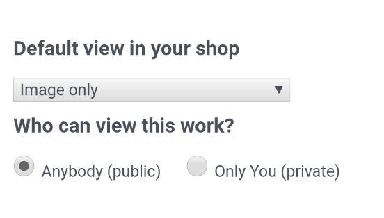

# RedScraper
[](#redscraper) 
 
 
 
This is RedBubble Scraper  
100% Shell Script

RedScraper takes all of your items informations and create a json ([output example](./example/output_example.json)) 

#### Requirements
Works only with items you have uploaded on RedBubble with this config:


#### Launch
all you need is change data in [user_config.sh](./user_config.sh) 
```user config
# RedBubble author
declare redbubble_author="pamposdev"

# RedBubble items
declare -a redbubble_items=(
	"37747133-autumn-2"
	"37958581-color-hit"
)
```
you can take data from this example links:
```example links
https://www.redbubble.com/people/pamposdev/works/37747133-autumn-2
https://www.redbubble.com/people/pamposdev/works/37958581-color-hit
```
save and launch:
```launch command
$ ./redscraper.sh
```

#### Result
you can find the result of all scraping in root folder named **"parsed"**

#### License
* Code and Contributions have **MIT License**
* Images and logos have **CC BY-NC 4.0 License**
* Documentations and Translations have **CC BY 4.0 License**

###### Copyleft (c) 2018-2019 [Simone Lampacrescia](https://pamposdev.com) [[PamposDev](https://pamposdev.com)] <[simo.lampac@gmail.com](mailto:simo.lampac@gmail.com)>